```mermaid
---
title: "Anfrage Flow"
---
flowchart
	136865{"Choose \ninsurance\n"} --- 979959["IM Sound"]
	136865 --- 444918["SINFONIMA"]
	979959 --- 154197{"Value > 20.000"}
	205444(["Anfrageformular Start\n"]) --- 136865
	154197 ---|"No"| 712291["Full online process"]
	154197 ---|"Yes"| 713757["Request process"]
	713757 --- 549359(["Success Request"])
	712291 --- 240490{"Value > 10.000"}
	240490 ---|"Yes"| 448202(["Success but needs to provide list"])
	240490 ---|"No"| 839786(["Full Success"])
	444918 --- 627754["SINFONIMA request process"]
	627754 --- 460803(["Success Request"])
	subgraph 979959["IM Sound"]
	end
	subgraph 444918["SINFONIMA"]
	end
	subgraph 712291["Full online process"]
	end
```

Mermaid Flow Diagram Link: [https://www.mermaidflow.app/]

Logic differentiates between 2 flows:

1. Request (data-flow="request")
2. Online (data-flow="online)

Additional data points for online flow

- ProberaumStrasse
- ProberaumHausnummer
- ProberaumPostleitzahl
- ProberaumOrt
- Schloss20mm
- Schliesszylinder
- Sicherheitsbeschlaege
- Fenster
- Pilzkopfverriegelung
- Strasse
- Hausnummer
- Postleitzahl
- Ort
- Iban
- Sepa
- Beitrag
- Gelesen
- Dateneinwilligung
- Verzicht
- Unverschluesselt
- Nachricht2
